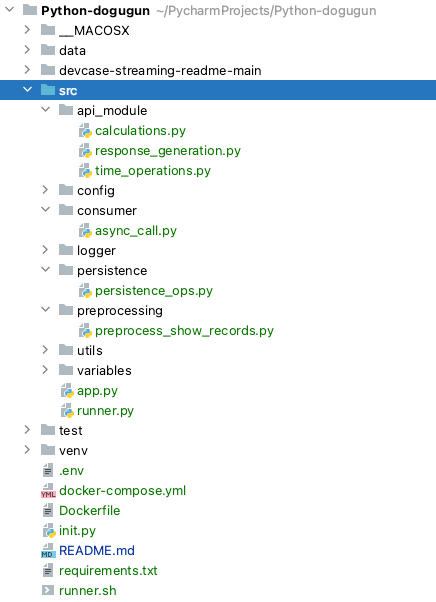

# Takehome Case Study for Sytac
As described in the description documents the task is to paralelly listen to 3 stream sources and create some 
insights/reports from them. This pure Python project is develop to satisfy the project requirements.

## Project Function
The project is basically formed of 3 parts. 
- Consuming
- Data Storage & Processing
- API
### Consuming Streams
The consumer is using aiohttp session object to capture streaming data for 3 sources, Sytflix, Sytazon and Sysney in 
parallel. As the objects are captured, they are saved in async tasks to not let readers lose any time and miss some data. 

Meanwhile also Sytac name check is also asynchronically done for the same reason. 

The captured objects are saved to data/raw folder in binary format in async as well. 

### Data Storage
Data storage is done locally in the project directory under data folder. It consists of 4 different folders:
- **raw:** where binary data are saved during consuming
- **archive:** as soon as the consumer stops from either 20 second timeout or finding `Sytac` 3 times, we preprocess 
them and move to archived folder
- **processed:** after the consuming finished, the collected binary data from raw folder are combined together to a 
dataframe and saved in a csv file for easy querying.
- **report:** as the consumer finishes, the run time of 3 parallel readers' runtimes are saved inside a report file 
with a timestamp and saved in report folder.

**Future Improvement:** A future improvement could be saving the outputs to S3 or MinIO environment for a better persistency

### Outputs
The outputs are for project outputs. They are calculated over processed data. 
- **User Reports:** They include user information: name, age and id along with their event history and they are served 
over API as a list of json objects. In order to access this service you can simply call ```http://127.0.0.1:5000/user_report```
<br/>Response object will be in below format. event_list may include multiple events.  
``` !json
[
  {
    "event_list": [
      {
        "event": "stream-finished",
        "event_date": "06-12-2023 16:04:56.339",
        "first_actor": "Lill Kormer",
        "show_id": "s10",
        "show_platform": "Sysney",
        "show_title": "Jorld's Lost Hifgerous Xkark?"
      }
    ]
    "user": {
      "age": "39",
      "user_id": "9",
      "user_name": "Herculie Eadon"
    }
  }
]
```

- **Shows After 2020:** The output is again given over API as a single json object with a text key and value of number 
of shows. In order to access this data, you can call ```http://127.0.0.1:5000/recent_shows```. You can expect the 
output with a json format and a key-value pair:
</br>```{"recent_shows":"96"}```
- **Runtime of Individual Consumers:** As the main async process ends, the individual runtimes of consumers as saved as 
text file under `data/report` folder with a timestamp. Below you can see a sample content of this file:
```
EXECUTION TIME FOR RUN 20231207_170121 
sytflix was listened for 19.69577193260193 seconds. 
sytazon was listened for 19.97288703918457 seconds. 
sysney was listened for 19.729387044906616 seconds. 

```
- **Successful Streams:** They are also served over API with a list of user ids and number of successfully finished shows via ```http://127.0.0.1:5000/successful_streams```
<br/>A sample output will look like:
</br>```[{"successful_streams":1.0,"user":4.0},{"successful_streams":1.0,"user":10.0}]```
- **Start Events Rate:** The ratio of start events in Sytflix over all events in Sytflix can be accessed via 
endpoint:```http://127.0.0.1:5000/start_events``` to have an output in key value format of: 
</br>```{"start_event_rate(%)":"38.40155945419103"}```

The launching of API and its dependents will be explained in future section of **Execution**

## Project Structure
This section briefly explains the code structure which is aimed to keep as simple as possible.


All the code files are kept under src folder. 
- **api_module**: includes data processing and modification operations are kept here. 
- config: parsing stream configurations from either .env file or environment variables
- logger: logging object
- **persistence**: this module is responsible for saving data to and reading data from filesystem  
  - saving binary objects to filesystem
  - reading binary objects from filesystem to create tabular data 
  - saving tabular data to filesystem
  - reading tabular data to be processed for API
- **preprocessing**: creating tabular data from collected binary objects
- utils: utility functions
- variables: static variables

**Tests**
<br/>Tests are kept under test folder for each corresponding module in src folder. 


## Execution & Deployment
The project can be checked out from github and can be run in different formats. But before running it is important to 
check some prerequisites
### Configuration & Init
The configuration variables are stream endpoint, which is ```http://localhost:8080/``` by default however if it is run 
together with `sytacdocker/video-stream-server-arm` it must be updated to ```http://data-provider:8080/```. Here it is 
important to note that "data-provider" is defined in docker-compose.yml file and it could be replaced by any name defined there.

**If you are a developer:** In order to use the local `.env` file, please run init.py file with below command:
<br/>``` python -m init ```
<br/>It will create a sample .env file for you. 


### Run Modes
Based on the use case the data stream can be a separate task or container, it can be run together with consumer & API,
and in the DEV mode both can be manually launched.

#### Entry Points
Both functionalities, consumer and API can be run from entry points defined by click package in Python. They are 
accessible in `runner.py` file. In order to trigger them individually run below commands:
```
Consumer:
python src/runner.py main start-consumer

API:
python src/runner.py main start-api
```

The start-consumer command is also called in `runner.sh` which is called inside `Dockerfile` but
API starter is supposed to be called with `flask run --host 0.0.0.0 --port 5000` command in container.


#### Separate Container Run Mode
Dockerfile includes the run steps for both data consumer and API. You need to just build then run it.
<br/>**Important Note:** Do not forget to put the both containers(consumer and streamer) under same docker network. 
Otherwise they will not communicate and API will not be accessible. 

#### Together Run Mode
As a use case, they can be launched together to make things simple. In that case while in the root folder of the 
project, it is sufficient to run ```docker-compose up```. 

For additional runs, just go into the docker file and trigger the consumer manually with below command:
```python src/runner.py main start-consumer``` 
<br/> Just keep in mind that API is already awaken.

#### Local Run Mode
This one is for the non-dockerized environments. It is pretty straightforward and can be triggered as explained in Entry 
Points section.
After making sure that `sytacdocker/video-stream-server-arm` is running run below commands for each functionality:
```
For Consumer:
python src/runner.py main start-consumer

For API:
python src/runner.py main start-api
```

### API Endpoints


